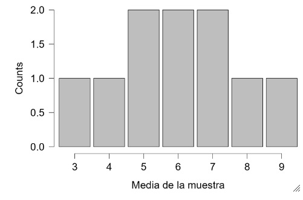

```{r setup, include=FALSE}
knitr::opts_chunk$set(echo = FALSE)
```

## Distribución muestral de la media.

Es el conjunto de la medias de todas las muestras de tamaño n que es posible obtener de una población de tamaño N.


## Ejemplo


Suponga que se tiene una población de 5 familias (N = 5) y la variable que se estudia es el número de hijos de cada familia.

| Familia           | Hijos       | 
|-------------------|-------------|
|Pérez              | 2           |         
| Gómez             | 4           | 
|Duran              | 6           | 
| Hidalgo           | 8           | 
| Ramiréz           | 10          | 

## Media poblacional.

Por lo tanto:

+ la media poblacional es:

<center>
$\mu = \frac{\sum x}{N} = \frac{30}{5} = 6$
<center>


## Desviación estándar poblacional.

| Familia           | Hijos       | $x-\mu$       | $(x-\mu)^{2}$ |
|-------------------|-------------|---------------|--------------|
|Pérez              | 2           | (2-6)=-4      | (2-6)^{2} =16|
| Gómez             | 4           | (4-6)=-2      | (4-6)^{2} = 4|
|Duran              | 6           | (6-6)= 0      | (6-6)^{2} = 0 |
| Hidalgo           | 8           | (8-6)=2       | (8-6)^{2}  = 4|
| Ramiréz           | 10          | (10-6)=4      | (10-6)^{2}  =16|


+ la desviación estandar es:

<center>
$\sigma = \sqrt{\frac{\sum(x-\mu)^2}{N}} = \sqrt{\frac{40}{5}} = \sqrt{8} = 2,8264$
<center>


## Número de muestras de tamaño n=2.

Para determinar el número de muestras posibles, en un apoblación de tamaño N, hay dos formas:

+ **Muestreo con reemplazo.**

Número de muestras diferentes $= N^{n}$


+ **Muestreo sin reemplazo.**

Número de muestras diferentes $= \binom{N}{n} = \frac{N!}{n!(N-n)!}.$


Para el ejemplo 

Número de muestras diferentes $= \binom{5}{2} = \frac{5!}{2!(5-2)!} = 10.$


## 
| Muestra| Hijos | $\overline{X}$  | $\overline{X} -\mu_{\overline{X}}$|($\overline{X} -\mu_{\overline{X}})^{2}$|     
|-------------------|-------------|---------------|--------------|-------------|
|Pérez, Gómez     | 2,4  | $\frac{2+4}{2} = 3$      | 3-6 = -3|  $(3-6)^{2} = 9$  |
| Pérez, Duran             | 2,6  | $\frac{2+6}{2} = 4$      | 4-6 = -2| $(4-6)^{2}= 4$    |
|Pérez, Hidalgo            | 2,8  | $\frac{2+8}{2} = 5$      | 5-6 = -1 | $(5-6)^{2} = 1$    |
| Pérez, Ramiréz           | 2,10 | $\frac{2+10}{2} = 6$     | 6-6 = 0|  $(6-6)^{2} = 0$    |
| Gómez, Duran             | 4,6  | $\frac{4+6}{2} = 5$      | 5-6 = -1|   $(5-6)^{2} = 1$    |
| Gómez, Hidalgo           | 4,8  | $\frac{4+8}{2} = 6$      | 6-6 = 0|     $(6-6)^{2} = 0$  |
| Gómez, Ramiréz           | 4,10 | $\frac{4+10}{2} = 7$     | 7-6 = 1|   $(7 -6)^{2} =1$    |
| Duran, Hidalgo           | 6,8  | $\frac{6+8}{2} = 7$      | 7-6 = 1|    $(7-6)^{2} = 1$   |
| Duran, Ramiréz           | 6,10 | $\frac{6+10}{2} = 8$     | 8-6 = 2|    $(8 - 6)^{2} =4$   |
|Hidalgo, Ramiréz          | 8,10 | $\frac{8+10}{2} = 9$     | 9-6 = 3|    $(9 - 6)^{2} = 9$   |

##
| Muestra| Hijos | $\overline{X}$  | $\overline{X} -\mu_{\overline{X}}$|($\overline{X} -\mu_{\overline{X}})^{2}$|     
|-------------------|-------------|---------------|--------------|-------------|
| Duran, Ramiréz           | 6,10 | $\frac{6+10}{2} = 8$     | 8-6 = 2|    $(8 - 6)^{2} =4$   |
|Hidalgo, Ramiréz          | 8,10 | $\frac{8+10}{2} = 9$     | 9-6 = 3|    $(9 - 6)^{2} = 9$   |
|Total| | 60 | 0 | 30|


Donde la media de las medias ($\mu_{\overline{X}}$) es:


<center>
$\mu_{\overline{X}} = \frac{\sum \overline{X}}{N} = \frac{60}{10} = 6.$
<center>

Aquí N es el número total de muestras(se convierte en la población)

## Con respecto a la media podemos concluir 

Podemos concluir que la media de la distribución muestral de las medias es igual a la media de la población o dicho en otras plabras el valor esperado de la media es igual a la media de la población. Es decir: 

<center>
$\mu = E(X) = \mu_{\overline{X}} = \frac{\sum \overline{X}}{N}.$
<center>

## Con respecto la desviación estándar podemos concluir.

La desviación estandar de todas las medias o sea la desviación estándar de la distribución muestral de las medias es:

<center>
$\sigma_{\overline{X}}= \sqrt{\frac{\sum (\overline{X} - \mu_{\overline{X}})^{2}}{N}} = \sqrt{\frac{30}{10}} = 1,732$
<center>

$\overline{X}$ esta indicando que hace referencia a la desviación estándar de la distribución muestral de la media.

A este valor se le conoce como **error estándar de la media**  y tiene una relación con la desviación estándar de la población que se expresa mediante la siguiente ecuación:

<center>
$\sigma_{\overline{X}} = \frac{\sigma}{\sqrt{n}}\sqrt{\frac{N-n}{N-1}} = \frac{2.828}{\sqrt{2}}\sqrt{\frac{5-2}{5-1}} = 1.73$
<center>

Que es el mismo valor que se encontro calculando la desviación estándar de la distribución muestral de la media.

## Distribución muestral de la media

Distribución muestral de la media, agrupada según la frecuencia con que aparece cada valor.

|Media de la muestra| Frecuencia Observada |
|-------------------|----------------------|
|3|1|
|4|1|
|5|2|
|6|2|
|7|2|
|8|1|
|9|1|
|Total|10|

## Gráfica de barras de la distribución muestral de la media.

<center>

</center>

Las medias de la muestra tienden agruoparse alrededor de la media de la población lo cual es una carácteristica de la distribución normal; aunque en este ejemplo el tamaño de la muestra es  pequeño, aún así se nota que la distribución de las medias muestrales tiende a ser de forma normal.

## 

La afirmación anterior, junto con:

<center>
$\mu = E(X) = \mu_{\overline{X}} = \frac{\sum \overline{X}}{N}.$
<center>

y

<center>
$\sigma_{\overline{X}} = \frac{\sigma}{\sqrt{n}}\sqrt{\frac{N-n}{N-1}}$
<center>


Se conoce como teorema central del límite.

## Teorema central del límite.


si X es una variable aleatoria para la que se conoce su media $\mu$ y su varianza $\sigma^{2}$, la distribución muestral de la media tiende a ser normal con media $\mu$ y desviación estándar 

<center>
$\sigma_{\overline{X}} = \frac{\sigma}{\sqrt{n}}\sqrt{\frac{N-n}{N-1}}$
<center>


La expresión $\sqrt{\frac{N-n}{N-1}}$ es llamado factor de corrección.

+ si la población es infinita o muy numerosa, la fracción $\frac{N-n}{N-1}$ resulta ser prácticamente uno.

## ¿Cuando se elimina este factor de correccción?

En general se dice que resulta aceptable eliminar este factor de corrección cuando.

<center>
$\frac{n}{N} \leq 0.05$
<center>

## Distribución de probabilidad de la distribución muestral de la media.


|Media de la muestra| Frecuencia Observada |Probabilidad de las medias muestrales|
|-------------------|----------------------|----------------------|
|3|1|0.10|
|4|1|0.10|
|5|2|0.20|
|6|2|0.20|
|7|2|0.20|
|8|1|0.10|
|9|1|0.10|
|Total|10|1|


##

¿Cuál es la probabilidad de que la media de una muestra seleecionada fuese de 6?

La probabilidad de que la media de dicha muestra sea de 6 es de 0,20.

## Ejercicio 1.


Se extrae una muestra de 30 elementos, de una población que se sabe que tiene un gran número de elementos y cuya media y desviación estándar son $\mu = 162$ y $\sigma = 20.$ Encuentre la probabilidad de que la media de esa muestra

+ Sea superior a 170.

+ Este entre  152 y 172.


## Ejercicio 2.

Quinientos cojinetes de bolas tienen un peso promedio de 5,02 onzas y una desviación típica de 0,30 onzas. Hallar la probabilidad de que en una muestra al azar de 100 cojinetes elejidos entre este grupo tenga un peso total:

+ Comprendido entre 496 y 500 onzas.

+ De más de 510 onzas.


## Estandarización si $n \leq 30$ o no se conoce $\sigma$ es decir tenemos $s$ desviación estándar de la muestra.

Si $n\leq 30$ o no se conoce $\sigma$, es decir tenemos $s$ desviación estándar de la muestra (la muestra puede ser mayor a 30 pero no se conoce la desviación estándar de la población). Se estándariza como:

+ **Población infinita**

<center>
$t = \frac{\overline{X} - \mu}{\frac{s}{\sqrt{n}}} = \frac{\overline{X} - \mu}{\frac{s}{\sqrt{n-1}}}$
<center>

es decir tiene una distribución t de student con n-1 grados de libertad.


##
+ **Población finita**

<center>
$t = \frac{\overline{X} - \mu}{  \frac{s}{\sqrt{n}}\sqrt{\frac{N - n}{{N-1}}}   } = \frac{\overline{X} - \mu}{\frac{s}{\sqrt{n-1}}}$
<center>

es decir tiene una distribución t de student con n-1 grados de libertad.

## Ejemplo 1

El tiempo promedio  que gasta el bus urbano en Barranquilla es de 70 minutos. Se toma una muestra aleatoria de 12 recorridos y con dichos datos se ubtuvo una desviación estándar de 8 minutos.

+ ¿Cuál es la probabilidad de que la media muestral sea inferior a 76.26 minutos?

+ ¿Cuál es la probabilidad de que el promedio muestral sea superior a 64.24 minutos?
